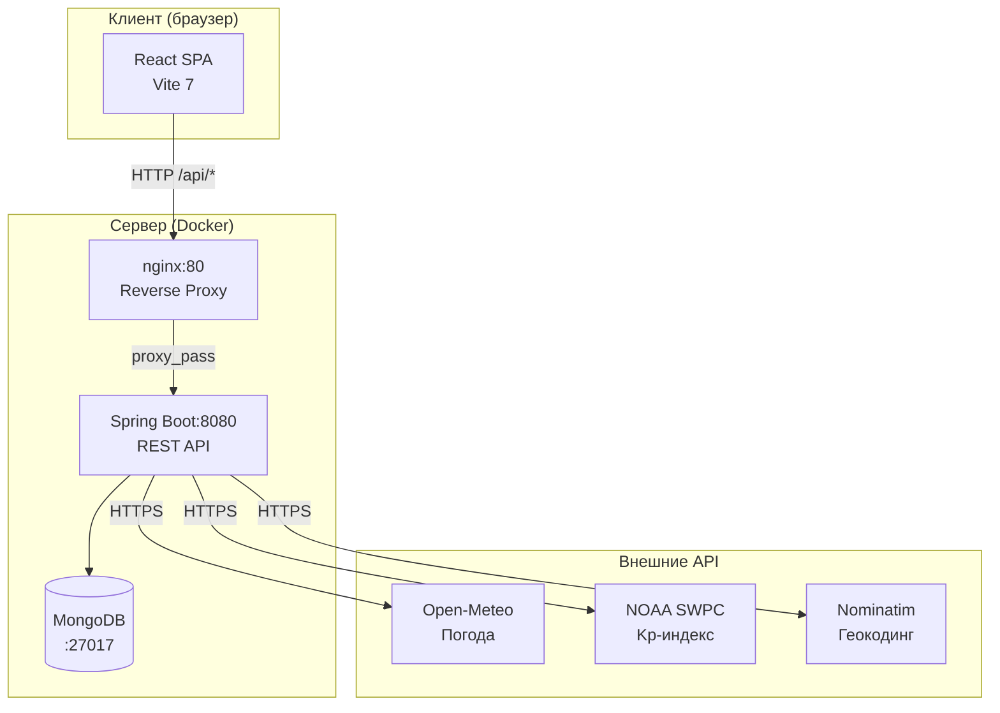
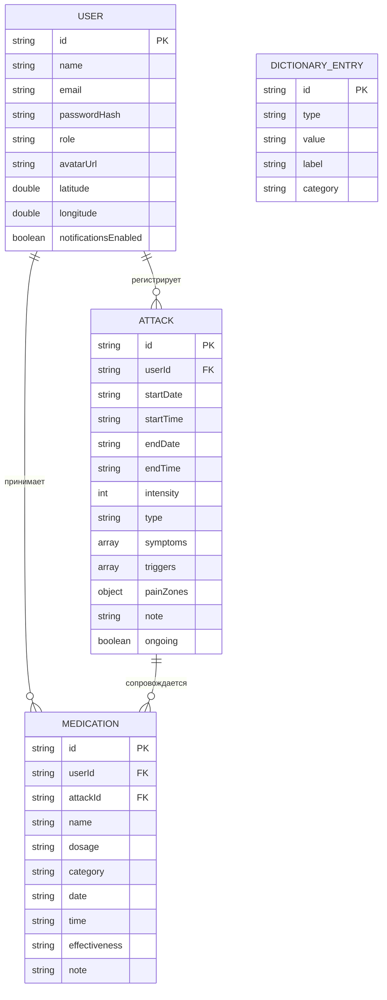
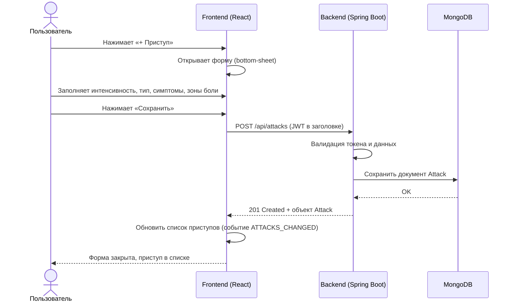
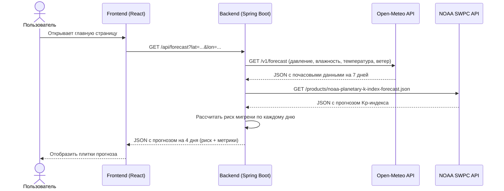
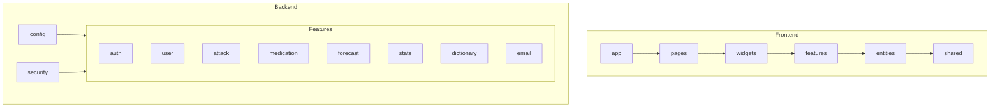

# Пояснительная записка к курсовому проекту

**Дисциплина:** Технология программирования  
**Студент:** Пустовойт Кирилл Александрович  
**Группа:** бИСТ-234, 3 курс  
**Репозиторий:** https://github.com/godmozzarella/calm-project

---

## Введение

Головная боль является одной из наиболее распространённых проблем со здоровьем, с которой сталкиваются люди разных возрастных групп. По данным ВОЗ, около 50% взрослого населения страдает от головных болей, при этом большинство из них не ведут систематического учёта приступов, симптомов и принимаемых препаратов. Это существенно затрудняет анализ состояния здоровья, выявление провоцирующих факторов и взаимодействие с врачом.

Существующие решения либо слишком общие (заметки, таблицы), либо ориентированы на зарубежный рынок и не учитывают специфику отечественного пользователя. В связи с этим была сформулирована цель курсового проекта:

> **Разработать веб-приложение для систематического учёта приступов головной боли, принимаемых препаратов и сопутствующих факторов с аналитикой и экспортом данных.**

Для достижения поставленной цели необходимо решить следующие задачи:

1. Определить сценарии использования и требования к приложению.
2. Спроектировать архитектуру клиент-серверного веб-приложения.
3. Реализовать и протестировать прототип с базовым функционалом.

---

## 1. Функциональное назначение программного средства

### 1.1 Классы решаемых задач

- **Задачи ввода и хранения данных** — регистрация приступов головной боли и принимаемых препаратов с подробными характеристиками.
- **Задачи анализа и визуализации** — построение статистики по приступам, выявление паттернов, корреляция с погодными условиями.
- **Задачи оптимизации взаимодействия с врачом** — формирование структурированного отчёта в формате PDF/CSV для передачи специалисту.

### 1.2 Функциональное назначение

Программа предназначена для ведения личного дневника головной боли и анализа его данных.

Пользователь имеет возможность:
- регистрировать приступы головной боли с указанием даты, времени, интенсивности (шкала 1–10), типа боли, симптомов и триггеров;
- отмечать локализацию боли на интерактивной карте зон головы (спереди и сзади) с указанием интенсивности по зоне;
- записывать принимаемые препараты с дозировкой, категорией и оценкой эффективности;
- просматривать статистику и KPI-показатели за выбранный период;
- получать прогноз погодного риска мигрени на 4 дня на основе атмосферного давления, влажности, температуры, ветра и геомагнитной активности;
- экспортировать отчёт о состоянии здоровья в формате PDF или CSV.

### 1.3 Нефункциональные требования и ограничения

- Взаимодействие фронтенда и бэкенда осуществляется через **REST API** (JSON).
- Аутентификация пользователей реализована на основе **JWT-токенов**.
- Приложение упаковано в **Docker**-контейнеры и запускается командой `docker compose up`.
- Интерфейс адаптирован для мобильных устройств (responsive design, bottom-sheet модальные окна).
- Внешние API используются без ключей (открытые сервисы): Open-Meteo, NOAA SWPC.

### 1.4 Аналитические метрики

Приложение рассчитывает следующие метрики, которые отображаются на странице статистики и попадают в PDF-отчёт:

**KPI за период (по умолчанию — последний месяц):**

| Метрика | Описание | Источник |
|---------|----------|----------|
| `total` | Общее число приступов | Подсчёт записей Attack |
| `avgIntensity` | Средняя интенсивность боли | Среднее по `intensity` |
| `longestStreak` | Самая длинная серия дней без приступов | Анализ календаря |
| `overuseDays` | Дни приёма обезболивающих (MOH-риск) | Подсчёт записей Medication |

**Паттерны:**

- `topTriggers` — топ-6 триггеров по числу дней с приступами (стресс, недосып и т.п.).
- `topSymptoms` — топ-6 сопутствующих симптомов (тошнота, светобоязнь и т.п.).

**Корреляция с погодой:**

| Метрика | Описание |
|---------|----------|
| `attacksOnElevatedRisk` | Доля приступов в дни с высоким погодным риском |
| `avgRiskOnAttackDays` | Средний риск-индекс в дни с приступом (1–3) |
| `avgRiskOnPainFreeDays` | Средний риск-индекс в дни без боли |
| `avgPressureOnAttack` | Среднее атмосферное давление в дни приступов (гПа) |
| `avgPressureOnPainFree` | Среднее давление в дни без боли (гПа) |

Сравнение этих пар позволяет выявить, действительно ли пользователь чувствителен к перепадам давления или геомагнитным бурям.

---

## 2. Проектная часть

### 2.1 Архитектура приложения

Для обеспечения разделения ответственности и независимого масштабирования частей системы была выбрана **клиент-серверная архитектура** с разделением на три уровня: клиент (SPA), сервер (REST API) и база данных.

На фронтенде применяется архитектурная методология **Feature-Sliced Design (FSD)**, которая разделяет код на слои: `app`, `pages`, `widgets`, `features`, `entities`, `shared`.

```
calm-project/
├── frontend/          # React 19 + Vite 7 + SCSS Modules (FSD)
│   └── src/
│       ├── app/       # Инициализация, роутер, глобальные стили
│       ├── pages/     # Страницы (MainPage, StatsPage, AdminPage)
│       ├── widgets/   # Самодостаточные блоки UI (AttackSection, ForecastSection …)
│       ├── features/  # Бизнес-фичи (AddAttack, AddMedication, EditProfile …)
│       ├── entities/  # Доменные модели (attack, medication, user)
│       └── shared/    # UI-компоненты, утилиты, API-клиент
└── backend/           # Spring Boot 3.4 + Spring Data MongoDB + JWT
    └── src/main/java/com/calm/
        ├── feature/   # Функциональные модули (attack, medication, forecast …)
        ├── config/    # Конфигурация (Security, CORS, MongoDB)
        └── security/  # JWT-фильтры, AuthenticatedUser
```

**Диаграмма компонентов:**



### 2.2 Проектирование пользовательского интерфейса

Интерфейс реализован в виде **одностраничного веб-приложения (SPA)** с адаптивной вёрсткой. На мобильных устройствах формы ввода данных открываются как «нижние шторки» (bottom-sheet). Навигация между разделами осуществляется через боковую панель.

Основные экраны:

| Экран | Назначение |
|-------|-----------|
| Главная (дашборд) | Список приступов, препаратов, карта зон боли, прогноз погоды |
| Статистика | Графики, KPI, экспорт PDF/CSV |
| Профиль | Редактирование данных, аватар, настройки уведомлений |
| Админ-панель | Управление пользователями, справочниками |

### 2.3 Модель данных

Основными сущностями системы являются **User**, **Attack**, **Medication** и **DictionaryEntry**.

Для их описания используются следующие атрибуты:

- **User** — идентификатор, имя, email, хэш пароля, роль, URL аватара, координаты (широта/долгота), флаг уведомлений.
- **Attack** — идентификатор, ссылка на пользователя, дата/время начала и конца, интенсивность, тип боли, массив симптомов, массив триггеров, карта зон боли, заметка.
- **Medication** — идентификатор, ссылка на пользователя, ссылка на приступ, название, дозировка, категория, дата/время приёма, оценка эффективности, заметка.
- **DictionaryEntry** — идентификатор, тип (SYMPTOM / TRIGGER / MEDICATION_PRESET), значение, метка, категория.

**Диаграмма сущностей (ER):**



### 2.4 Моделирование работы приложения

**Диаграмма последовательности — регистрация приступа:**



**Диаграмма последовательности — получение прогноза погоды:**



---

## 3. Конструирование программного продукта

В качестве основной IDE использовалась **IntelliJ IDEA**. При разработке применялись следующие языки и технологии:

**Фронтенд:**
- JavaScript (React 19, react-router-dom 7)
- SCSS Modules (адаптивная вёрстка)
- HTML5

**Бэкенд:**
- Java 21 (Spring Boot 3.4, Spring Security, Spring Data MongoDB)
- JWT (jjwt), BCrypt

**Инфраструктура:**
- Docker, Docker Compose
- MongoDB 7
- nginx (reverse proxy)

### 3.1 Диаграмма пакетов



### 3.2 Тестирование

Реализованы unit-тесты на JUnit 5 + Mockito + AssertJ.
Тесты находятся в [`backend/src/test/java/`](backend/src/test/java/).

**Покрытые модули:**

| Тест | Что проверяет | Кол-во |
|------|--------------|--------|
| `AttackServiceTest` | CRUD-логика приступов, контроль доступа (NotFoundException на чужой ресурс), корректность сброса endDate при ongoing=true | 6 |
| `JwtServiceTest` | Выпуск и парсинг JWT-токенов, валидация подписи, проверка TTL, защита от короткого секрета | 4 |
| `CalmApplicationTests` | Smoke-тест: загрузка Spring-контекста, проверка bean wiring | 1 |

**Запуск:**

```sh
cd backend
mvn test
```

Все тесты независимы от MongoDB — репозитории мокаются через Mockito.

**Контрольный пример для сценария «Регистрация приступа»:**

| № | Действие | Ожидаемый результат |
|---|----------|-------------------|
| 1 | Нажать кнопку «+ Приступ» | Открывается форма добавления |
| 2 | Установить интенсивность 7, выбрать тип «Пульсирующая» | Значения отображаются в форме |
| 3 | Отметить зону «Висок» на карте головы | Зона подсвечивается |
| 4 | Нажать «Сохранить» | Форма закрывается, приступ появляется в списке |
| 5 | Открыть статистику | Новый приступ учтён в KPI |

### 3.3 Описание API

Полный список эндпоинтов бэкенда доступен через Swagger UI: `http://localhost:8080/api/swagger-ui.html`

#### Аутентификация

| Метод | Путь | Описание |
|-------|------|----------|
| POST | `/api/auth/register` | Регистрация нового пользователя |
| POST | `/api/auth/login` | Вход, возвращает JWT-токен |

#### Приступы

| Метод | Путь | Описание |
|-------|------|----------|
| GET | `/api/attacks` | Список всех приступов пользователя |
| POST | `/api/attacks` | Создать новый приступ |
| PUT | `/api/attacks/{id}` | Обновить приступ |
| DELETE | `/api/attacks/{id}` | Удалить приступ |

#### Препараты

| Метод | Путь | Описание |
|-------|------|----------|
| GET | `/api/medications` | Список препаратов пользователя |
| POST | `/api/medications` | Добавить препарат |
| PATCH | `/api/medications/{id}` | Обновить поле (например, эффективность) |
| DELETE | `/api/medications/{id}` | Удалить препарат |

#### Прогноз погоды

| Метод | Путь | Описание |
|-------|------|----------|
| GET | `/api/forecast?lat={lat}&lon={lon}` | Прогноз риска мигрени на 4 дня |

#### Статистика

| Метод | Путь | Описание |
|-------|------|----------|
| GET | `/api/stats/summary?period={period}` | KPI, паттерны, погодная корреляция |

#### Пользователь

| Метод | Путь | Описание |
|-------|------|----------|
| GET | `/api/users/me` | Данные текущего пользователя |
| PATCH | `/api/users/me` | Обновить профиль |
| POST | `/api/users/me/avatar` | Загрузить аватар |
| DELETE | `/api/users/me/avatar` | Удалить аватар |

---

### 3.4 Используемые внешние API

##### Open-Meteo — прогноз погоды

**Сайт:** https://open-meteo.com  
**Лицензия:** бесплатно, без ключа (CC BY 4.0)

Используется для получения почасового прогноза атмосферного давления, влажности, температуры и скорости ветра.

| Эндпоинт | Назначение |
|----------|-----------|
| `https://api.open-meteo.com/v1/forecast` | Почасовой прогноз погоды по координатам |
| `https://geocoding-api.open-meteo.com/v1/search` | Поиск города по названию (геокодинг) |
| `https://nominatim.openstreetmap.org/reverse` | Обратный геокодинг (координаты → название города) |

**Пример запроса:**
```
GET https://api.open-meteo.com/v1/forecast
  ?latitude=55.75&longitude=37.62
  &daily=temperature_2m_max,temperature_2m_min,wind_speed_10m_max
  &hourly=surface_pressure,relative_humidity_2m
  &wind_speed_unit=kmh&timezone=auto&forecast_days=7
```

**Параметры ответа, используемые в приложении:**

| Параметр | Описание |
|----------|---------|
| `surface_pressure` | Атмосферное давление на уровне поверхности (гПа) |
| `relative_humidity_2m` | Относительная влажность воздуха на высоте 2м (%) |
| `temperature_2m_max/min` | Максимальная и минимальная температура за день (°C) |
| `wind_speed_10m_max` | Максимальная скорость ветра на высоте 10м (км/ч) |

---

##### NOAA SWPC — геомагнитная активность (Kp-индекс)

**Сайт:** https://www.swpc.noaa.gov  
**Лицензия:** открытые данные (US Government, public domain)

Используется для получения прогноза планетарного Kp-индекса — показателя геомагнитной активности (шкала 0–9). Значения Kp ≥ 5 соответствуют геомагнитной буре и учитываются при расчёте риска мигрени.

| Эндпоинт | Назначение |
|----------|-----------|
| `https://services.swpc.noaa.gov/products/noaa-planetary-k-index-forecast.json` | Трёхчасовой прогноз Kp-индекса на 3 суток |

**Пример ответа:**
```json
[
  ["time_tag", "kp", "observed", "noaa_scale"],
  ["2025-05-25 00:00:00", "1.00", "observed", ""],
  ["2025-05-25 03:00:00", "2.00", "observed", ""],
  ...
]
```

**Интерпретация Kp-индекса в приложении:**

| Значение Kp | Уровень активности | Влияние на риск |
|------------|-------------------|----------------|
| 0 – 3 | Спокойно | Не учитывается |
| 4 | Умеренная активность | Учитывается как предупреждение |
| 5 – 6 | Геомагнитная буря G1–G2 | Повышает риск мигрени |
| 7 – 9 | Сильная буря G3–G5 | Значительно повышает риск |

---

## Контекстная диаграмма


---

## Заключение

В ходе выполнения курсового проекта был разработан прототип веб-приложения **Calm** — персонального дневника головной боли.

Реализованы следующие функции:
- регистрация и аутентификация пользователей (JWT);
- ведение дневника приступов с детальными характеристиками (интенсивность, тип, симптомы, триггеры, зоны боли);
- учёт принимаемых препаратов с оценкой эффективности;
- интерактивная карта зон боли (вид спереди и сзади);
- прогноз погодного риска мигрени на 4 дня (Open-Meteo + NOAA SWPC Kp-индекс);
- статистика и KPI-аналитика за период;
- экспорт отчёта в форматах PDF и CSV;
- администрирование: управление пользователями и справочниками;
- Docker-контейнеризация для воспроизводимого запуска.
